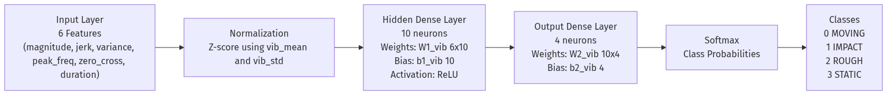
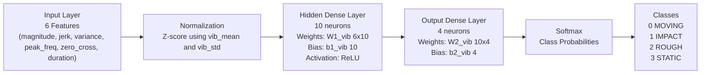

# TinyML Model Layer Diagram

```mermaid
flowchart LR
    I["Input Layer<br/>6 Features<br/>(magnitude, jerk, variance, peak_freq, zero_cross, duration)"]
    N["Normalization<br/>Z-score using vib_mean and vib_std"]
    H["Hidden Dense Layer<br/>10 neurons<br/>Weights: W1_vib 6x10<br/>Bias: b1_vib 10<br/>Activation: ReLU"]
    O["Output Dense Layer<br/>4 neurons<br/>Weights: W2_vib 10x4<br/>Bias: b2_vib 4"]
    S["Softmax<br/>Class Probabilities"]
    C["Classes<br/>0 MOVING<br/>1 IMPACT<br/>2 ROUGH<br/>3 STATIC"]

    I --> N --> H --> O --> S --> C
```

This diagram reflects the deployed embedded architecture: 6 -> 10 -> 4.
